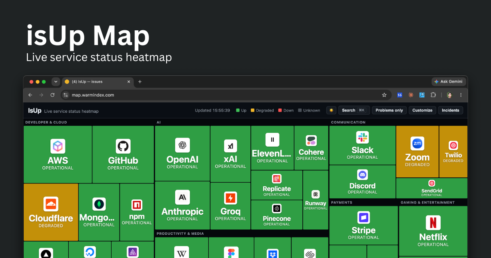
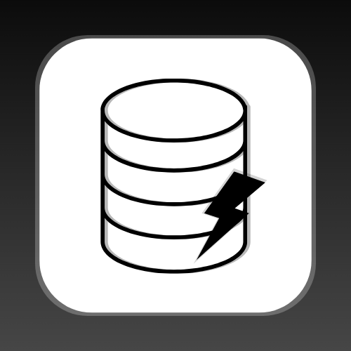

# isUpMap — Service Status Heatmap

[](https://deploy.workers.cloudflare.com/?url=https://github.com/Jaironlanda/isupmap)

**Live: [isUpMap](https://isupmap.com)** (Official)
**Live: [map.warmindex.com](https://map.warmindex.com)** (Backup)

A live **up / down heatmap** for 80+ popular internet services, rendered as a
stock-map style treemap with brand logos. Built on a single
[Cloudflare Worker](https://developers.cloudflare.com/workers/): a **Cron
Trigger** polls each service's official status and persists snapshots + an
incident log to **D1**, and a static frontend renders the treemap with
per-service uptime, an incident history, a command palette, light/dark themes,
and a mobile-friendly detail sheet.



## Features

- **Treemap heatmap** — services grouped into category "sectors", tiles sized by
  prominence and colored by status, each with a brand logo.
- **Per-service detail** — hover a tile (desktop) or tap it (mobile, opens a
  bottom sheet) for status, 24h/7d uptime, component rollup, active incident,
  and a **"Visit status page"** link.
- **Incident history** — server-recorded incidents (open/close/duration),
  persisted in D1 and shown in a side panel and per-service.
- **Command palette (⌘K)** — fuzzy-search services and run commands.
- **Local customization** — show/hide services or categories and a
  "problems only" filter, persisted in `localStorage`.
- **Notifications** — in-page toasts on status changes, plus optional opt-in
  **desktop notifications**.
- **Light / dark theme**, deep links (`?service=`, `?filter=problems`), and a
  favicon/title that reflect overall state.

## How it works

```
Cron (every 5m) ─▶ scheduled() ─▶ resolveStatus() × N      ┌─▶ Statuspage JSON   ({base}/api/v2/summary.json)
                       │           (1 retry on a blip)      ├─▶ RSS / Atom feed   (fast-xml-parser)
                       │   (src/sources.ts) ────────────────┘
                       │                                    └─▶ HTTP reachability ping
                       ├─▶ persist to D1 (src/db.ts): flap-dampen → upsert `current`,
                       │   open/close `incidents`; daily retention sweep
                       └─▶ publish finished snapshot to KV (SNAPSHOT_KV)
Browser (public/) ─poll /api/status every 45s─▶ Worker reads KV (Cache-API fronted) ─▶ treemap + uptime
                  └─open detail / panel ───────▶ GET /api/incidents (D1, cached)     ─▶ incident history
```

- A **Cron Trigger** (`*/5 * * * *`) invokes `scheduled()`, which resolves every
  service **concurrently** (`Promise.allSettled`, each upstream guarded by a 15s
  timeout + edge caching, with **one retry** on a transient blip so a flaky
  connection doesn't read as `unknown`). It persists the result to D1, then
  publishes the finished snapshot to **KV** for the read path.
- **Flap-dampening** (`src/db.ts`) — a non-`up` status must hold for **2
  consecutive polls** before it is committed to `current` or opens an incident;
  recovery to `up` is immediate, and an `unknown` (timed-out) probe holds the last
  status rather than resolving a real incident. A single glitchy upstream read
  therefore never paints a false outage. Resolved incidents older than 90 days are
  pruned once a day (~03:00 UTC).
- `GET /api/status` is a **fast KV read** of the snapshot the cron publishes (no D1
  query on the hot path), with per-service **uptime (24h / 7d)**. It's fronted by
  the **Cache API**; before the first cron run it serves a "warming" snapshot
  (never a live fan-out). The response carries a `stale` flag (older than 3 cron
  cycles) so the UI warns instead of showing frozen data.
- `GET /api/incidents` returns the recent incident log from D1 (Cache-API fronted).
- `GET /api/summary` returns a single **overall-status rollup** (worst status
  wins) plus a headline (`"All systems operational"` / `"2 down, 1 degraded"`),
  per-status counts, and the same `stale` flag — handy for compact embeds, badges,
  or a status banner. Same KV-read + Cache-API fronting as `/api/status`.
- All API routes are **rate-limited** per IP (60 req / 60s) via a Workers
  rate-limit binding.
- **Crawlable pages** — the dashboard is a client-rendered SPA, so for SEO the
  Worker also server-renders (no-JS) `GET /status/<id>` (per-service status +
  uptime) and `GET /status` (a directory), plus a generated `/sitemap.xml` and a
  static `robots.txt`. These give crawlers real content for queries like
  "is GitHub down?". See [src/pages.ts](src/pages.ts).
- The frontend ([public/app.js](public/app.js)) lays services out with a
  **squarified treemap**; tiles are sized by a per-service `weight` (layout only).

## Status model

Every service is normalized to one of: `up` · `degraded` · `down` · `unknown`.

| Source type   | How status is derived |
|---------------|-----------------------|
| **Statuspage** | Reads `{base}/api/v2/summary.json` (Atlassian). `status.indicator` maps: `none`→`up`, `minor`/`maintenance`→`degraded`. A `major`/`critical` indicator is **tempered by breadth** — since the indicator reflects peak component severity, not how much is affected — so it only reads `down` when the major outage is broad (≥50% of components, or too few components to judge); a localized one (e.g. a single region) → `degraded`. The summary also yields component rollups and active incidents for the detail view. |
| **RSS / Atom** | Parses the latest feed entry (via `fast-xml-parser`). Entries older than 48h are treated as resolved (`up`). A fresh entry mentioning *resolved/restored/operational* → `up`; *outage/down/major/critical* → `down`; anything else fresh → `degraded`. Heuristic. |
| **HTTP ping**  | A plain `GET`. `2xx`/`3xx` → `up`; other response → `degraded`; network error or timeout → `down`. |
| *(any)*        | A failed fetch or timeout → `unknown` (treated as "no data" — never opens an incident or counts as downtime). |

> Statuspage JSON is authoritative where available. RSS-based status is a
> best-effort heuristic, since incident feeds describe history rather than a
> current-state field.

## Data sources

All data comes from each service's **own public status page / feed**. IsUpMap is a
read-only aggregator and is not affiliated with any of these services. The list
lives in [src/services.ts](src/services.ts); for Statuspage entries the
`/api/v2/summary.json` path is appended to the `base` shown below.

Rows marked **⊘ disabled** have an upstream that no longer publishes a usable
machine-readable feed, so their status can't be resolved. They are shown as
permanently `unknown` (grey), hidden from the heatmap, and appear locked in the
**Customize** panel with the reason on hover — see
[Disabled services](#disabled-services) below.

| Service | Category | Source | Endpoint / base |
|---------|----------|--------|-----------------|
| GitHub | Developer & Cloud | Statuspage | `https://www.githubstatus.com` |
| Cloudflare | Developer & Cloud | Statuspage | `https://www.cloudflarestatus.com` |
| npm | Developer & Cloud | Statuspage | `https://status.npmjs.org` |
| DigitalOcean | Developer & Cloud | Statuspage | `https://status.digitalocean.com` |
| Vercel | Developer & Cloud | Statuspage | `https://www.vercel-status.com` |
| Netlify | Developer & Cloud | Statuspage | `https://www.netlifystatus.com` |
| MongoDB | Developer & Cloud | Statuspage | `https://status.mongodb.com` |
| Sentry | Developer & Cloud | Statuspage | `https://status.sentry.io` |
| CircleCI | Developer & Cloud | Statuspage | `https://status.circleci.com` |
| Linode | Developer & Cloud | Statuspage | `https://status.linode.com` |
| Render | Developer & Cloud | Statuspage | `https://status.render.com` |
| AWS | Developer & Cloud | RSS | `https://status.aws.amazon.com/rss/all.rss` |
| Google Cloud | Developer & Cloud | RSS | `https://status.cloud.google.com/en/feed.atom` |
| Microsoft Azure | Developer & Cloud | RSS · **⊘ disabled** | `https://azure.status.microsoft/en-us/status/feed/` |
| Supabase | Developer & Cloud | Statuspage | `https://status.supabase.com` |
| Fly.io | Developer & Cloud | Statuspage | `https://status.flyio.net` |
| Railway | Developer & Cloud | RSS · **⊘ disabled** | `https://railway.betteruptime.com/feed.rss` |
| Neon | Developer & Cloud | RSS | `https://neonstatus.com/pages/6878fc85709daa75be6c7e3c/rss` |
| PlanetScale | Developer & Cloud | Statuspage | `https://www.planetscalestatus.com` |
| Bunny.net | Developer & Cloud | Statuspage | `https://status.bunny.net` |
| Auth0 | Developer & Cloud | Statuspage · **⊘ disabled** | `https://auth0.statuspage.io` |
| Clerk | Developer & Cloud | Statuspage | `https://status.clerk.com` |
| HashiCorp | Developer & Cloud | Statuspage | `https://status.hashicorp.com` |
| Snowflake | Developer & Cloud | Statuspage | `https://status.snowflake.com` |
| Elastic | Developer & Cloud | Statuspage | `https://status.elastic.co` |
| New Relic | Developer & Cloud | Statuspage | `https://status.newrelic.com` |
| Grafana | Developer & Cloud | Statuspage | `https://status.grafana.com` |
| PagerDuty | Developer & Cloud | RSS · **⊘ disabled** | `https://status.pagerduty.com/history.rss` |
| Algolia | Developer & Cloud | RSS · **⊘ disabled** | `https://status.algolia.com/history.rss` |
| GitLab | Developer & Cloud | RSS | `https://status.gitlab.com/pages/5b36dc6502d06804c08349f7/rss` |
| Docker | Developer & Cloud | RSS | `https://www.dockerstatus.com/pages/533c6539221ae15e3f000031/rss` |
| Appwrite | Developer & Cloud | RSS | `https://status.appwrite.online/feed.rss` |
| Firebase | Developer & Cloud | RSS (Atom) | `https://status.firebase.google.com/en/feed.atom` |
| OpenAI | AI | RSS | `https://status.openai.com/feed.rss` |
| Anthropic | AI | Statuspage | `https://status.claude.com` |
| xAI | AI | RSS | `https://status.x.ai/feed.xml` |
| Groq | AI | Statuspage | `https://groqstatus.com` |
| ElevenLabs | AI | Statuspage | `https://status.elevenlabs.io` |
| Cohere | AI | Statuspage | `https://status.cohere.com` |
| Replicate | AI | Statuspage | `https://www.replicatestatus.com` |
| Pinecone | AI | Statuspage | `https://status.pinecone.io` |
| Runway | AI | Statuspage | `https://status.runwayml.com` |
| Hugging Face | AI | RSS | `https://status.huggingface.co/feed.rss` |
| Together AI | AI | RSS | `https://status.together.ai/feed.rss` |
| Perplexity | AI | RSS | `https://status.perplexity.com/default/history.rss` |
| Stability AI | AI | Statuspage | `https://status.stability.ai` |
| Deepgram | AI | Statuspage | `https://status.deepgram.com` |
| AssemblyAI | AI | Statuspage | `https://status.assemblyai.com` |
| Cursor | AI | RSS | `https://status.cursor.com/history.rss` |
| Stripe | Payments | Statuspage | `https://www.stripestatus.com` |
| Coinbase | Payments | Statuspage | `https://status.coinbase.com` |
| Shopify | Payments | Statuspage | `https://www.shopifystatus.com` |
| Plaid | Payments | Statuspage | `https://status.plaid.com` |
| Paddle | Payments | Statuspage | `https://paddlestatus.com` |
| Lemon Squeezy | Payments | RSS · **⊘ disabled** | `https://ohdear.app/status-page/lemon-squeezy-status/subscribe-rss` |
| Square | Payments | Statuspage | `https://www.issquareup.com` |
| Klarna | Payments | Statuspage | `https://status.klarna.com` |
| PayPal | Payments | RSS | `https://www.paypal-status.com/feed/rss` |
| Discord | Communication | Statuspage | `https://discordstatus.com` |
| Slack | Communication | RSS | `https://slack-status.com/feed/rss` |
| Zoom | Communication | Statuspage | `https://www.zoomstatus.com` |
| Twilio | Communication | Statuspage | `https://status.twilio.com` |
| SendGrid | Communication | Statuspage | `https://status.sendgrid.com` |
| Resend | Communication | Statuspage | `https://resend-status.com` |
| Mailgun | Communication | Statuspage | `https://status.mailgun.com` |
| Intercom | Communication | Statuspage | `https://www.intercomstatus.com` |
| HubSpot | Communication | Statuspage | `https://status.hubspot.com` |
| Atlassian | Productivity & Media | Statuspage | `https://status.atlassian.com` |
| Dropbox | Productivity & Media | Statuspage | `https://status.dropbox.com` |
| Datadog | Productivity & Media | Statuspage | `https://status.datadoghq.com` |
| Reddit | Productivity & Media | Statuspage | `https://www.redditstatus.com` |
| Figma | Productivity & Media | Statuspage | `https://status.figma.com` |
| Box | Productivity & Media | Statuspage | `https://status.box.com` |
| Squarespace | Productivity & Media | Statuspage | `https://status.squarespace.com` |
| Wikipedia | Productivity & Media | HTTP ping | `https://www.wikipedia.org` |
| Linear | Productivity & Media | Statuspage | `https://linearstatus.com` |
| Notion | Productivity & Media | Statuspage | `https://www.notion-status.com` |
| Cloudinary | Productivity & Media | Statuspage | `https://status.cloudinary.com` |
| Asana | Productivity & Media | Statuspage | `https://status.asana.com` |
| Airtable | Productivity & Media | Statuspage | `https://status.airtable.com` |
| Miro | Productivity & Media | Statuspage | `https://status.miro.com` |
| Canva | Productivity & Media | Statuspage | `https://www.canvastatus.com` |
| Webflow | Productivity & Media | Statuspage | `https://status.webflow.com` |
| DocuSign | Productivity & Media | Statuspage | `https://status.docusign.com` |
| Twitch | Gaming & Entertainment | Statuspage | `https://status.twitch.com` |
| Epic Games | Gaming & Entertainment | Statuspage | `https://status.epicgames.com` |
| Netflix | Gaming & Entertainment | HTTP ping | `https://www.netflix.com` |
| Roblox | Gaming & Entertainment | RSS | `https://status.roblox.com/pages/59db90dbcdeb2f04dadcf16d/rss` |
| Steam | Gaming & Entertainment | HTTP ping | `https://store.steampowered.com` |
| PlayStation Network | Gaming & Entertainment | HTTP ping | `https://www.playstation.com` |
| Riot Games | Gaming & Entertainment | HTTP ping | `https://www.riotgames.com` |
| Spotify | Gaming & Entertainment | HTTP ping | `https://open.spotify.com` |

### Disabled services

A service is **disabled** when its upstream no longer provides a status feed we can
trust — it stopped publishing a machine-readable feed, or the feed reports stale /
incorrect state. Rather than show a stale or misleading status, a disabled service is set to
`unknown` (grey), kept out of the heatmap, and listed — locked and labelled
`disabled`, with the reason on hover — in the **Customize** panel. The resolver
skips disabled services entirely (no fetch). To disable one, add a `disabled:
"<reason>"` string to its entry in [src/services.ts](src/services.ts).

Currently disabled (upstream no longer exposes a machine-readable feed, verified
2026-06-05):

| Service | Reason |
|---------|--------|
| Microsoft Azure | Global status feed publishes no machine-readable incident items (empty channel). |
| Auth0 | Statuspage JSON (`auth0.statuspage.io`) is stale — reports a phantom "minor outage" with no active incident while the live page shows all operational. |
| Railway | Migrated to a JS-rendered status page (`status.railway.com`); the old Betterstack feed is empty. |
| PagerDuty | `history.rss` now returns an HTML page instead of XML. |
| Algolia | `history.rss` now returns an HTML page instead of XML. |
| Lemon Squeezy | The Oh Dear feed URL now serves an HTML subscribe page instead of a feed. |

To add a service, append an entry to [src/services.ts](src/services.ts) with its
`category`, a `weight` (tile size), and a `source`. Brand logos are
**self-hosted**: add the service id to `LOGO_DOMAIN` ([public/app.js](public/app.js))
and drop a matching `<id>.png` (a ~128px favicon) in
[public/images/logo/services/](public/images/logo/services/).

> **Tips:** Statuspage hosts often `302`-redirect to a canonical domain
> (e.g. `status.zoom.us` → `www.zoomstatus.com`) — use the canonical host to
> avoid an extra hop. Some hosts (e.g. `status.x.ai`) put the JSON behind a
> Cloudflare bot challenge; use their RSS feed instead.

## Security

- **Rate limiting** — `/api/*` is capped at 60 requests / 60s per IP via a
  Workers rate-limit binding (`API_RATE_LIMITER`); over-limit returns `429`.
- **Caching** — `/api/status`, `/api/summary` and `/api/incidents` are wrapped in
  the Cache API; `/api/status` and `/api/summary` read the KV snapshot (D1 stays off
  the hot read path), so repeated requests cost neither a D1 query nor an upstream hit.
- **Headers / CSP** — [public/_headers](public/_headers) sets a strict
  `Content-Security-Policy` (no inline scripts), `X-Content-Type-Options`,
  `X-Frame-Options`, `Referrer-Policy`, and `Permissions-Policy` on static
  assets; the Worker adds `nosniff` + `Referrer-Policy` to API responses and a
  scripts-disabled (`script-src 'none'`) CSP to its server-rendered pages.

## Analytics

Google Analytics (GA4) is wired in [public/analytics.js](public/analytics.js)
and loads **only in production** — it's gated to non-localhost hosts (so it's
off during `wrangler dev`) and injected from a same-origin module to avoid an
inline script under the CSP. Update or remove `GA_ID` there to change it.

## Development

| Command | Purpose |
|---------|---------|
| `npm install` | Install dependencies (`fast-xml-parser`, `wrangler`). |
| `npm run db:schema:local` | Apply [`schema.sql`](schema.sql) to the **local** D1 (run once before first dev). |
| `npm run dev` | Local dev server at `http://localhost:8787`. |
| `npm run dev:cron` | Dev server with `--test-scheduled` so the cron can be triggered locally. |
| `npm run types` | Regenerate Worker types (`wrangler types`) after editing `wrangler.jsonc`. |
| `npm run typecheck` | `tsc --noEmit`. |
| `npm run deploy` | Deploy to Cloudflare. |

Trigger the cron and inspect the API locally:

```sh
npm run dev:cron
curl "http://localhost:8787/__scheduled"      # runs scheduled() once → persists to D1 + publishes to KV
curl -s http://localhost:8787/api/status | jq # served from KV, includes per-service uptime + stale flag
curl -s http://localhost:8787/api/incidents | jq
curl -s http://localhost:8787/api/summary | jq # overall status rollup + headline
```

> **Local cron note:** under plain `wrangler dev`, the documented
> `/cdn-cgi/handler/scheduled` test route currently throws a
> `DataCloneError: ... ScheduledController` (a wrangler local-shim bug). Use
> `npm run dev:cron` (`--test-scheduled`) and the `/__scheduled` route instead.
> Production crons invoke `scheduled()` natively and are unaffected.

## Deploying

### Deploy Button (recommended)

Click the button at the top of this README. Cloudflare will fork the repo,
provision a D1 database, and deploy — no manual config needed.

> After deploy, attach a **custom domain / route** in the Cloudflare dashboard
> (or add a `routes` entry to `wrangler.jsonc`), since `workers_dev: false`
> disables the `*.workers.dev` URL.

### Manual deploy

```sh
npx wrangler d1 create isupmap            # creates the D1 database; paste the printed id into wrangler.jsonc
npx wrangler kv namespace create SNAPSHOT_KV  # creates the snapshot cache; paste the id into wrangler.jsonc
npm run deploy                            # deploys the Worker and applies schema.sql to the remote D1
```

> Re-run `npm run db:schema:remote` after adding indexes/tables
> (`CREATE … IF NOT EXISTS` is idempotent).

### Rate-limit binding

`wrangler.jsonc` declares a rate-limit binding with `namespace_id: 1001`. This
number is an arbitrary local identifier — you do not need to create or change it;
Cloudflare provisions the binding automatically on deploy.

## Project structure

```
public/            Static frontend (served directly by Cloudflare)
  index.html         Page shell: header/toolbar, treemap, panels, detail modal, palette
  styles.css         Treemap palette, hover card, panels, command palette, bottom sheet, themes
  app.js             Poll loop, treemap, logos, detail sheet, palette, customization, toasts
  analytics.js       GA4 loader, production-only
  robots.txt         Crawl rules + sitemap pointer
  _headers           Security headers / CSP for static assets
  images/            OG image + self-hosted service icons (logo/services/<id>.png)
src/
  index.ts           Worker entry: scheduled() cron + rate-limited/cached /api/* + SSR /status pages & /sitemap.xml
  services.ts        Curated service list + status data sources + shared types
  sources.ts         Per-source-type fetch + normalize (Statuspage/RSS/HTTP)
  db.ts              D1 persistence: flap-dampening, snapshot upserts, incident transitions, uptime, retention
  pages.ts           Server-rendered status pages (/status, /status/<id>) + sitemap.xml
schema.sql           D1 schema (current / incidents / meta / probe_state) + indexes
wrangler.jsonc       Worker config (main, assets, cron, D1, KV snapshot cache, rate limit)
```

## Notes & limitations

- **Persistence** lives in D1: the `current` snapshot (one row per service),
  an `incidents` log (one row per non-`up` episode), and a `meta` row for the
  last run. Uptime is derived from incident intervals — no high-volume per-poll
  table — and incident queries are index-backed to keep D1 row reads low and flat
  as history grows.
- **History horizon** — resolved incidents are pruned after 90 days
  (`RETENTION_MS` in [src/db.ts](src/db.ts)); raise it for longer history.
- **Granularity** — status/uptime update every 5 minutes (the cron cadence); the
  UI polls every 45s and serves cached data in between.
- RSS status is heuristic (see the status-model table).
- `cf: { cacheTtl }` edge caching and the Cache API are no-ops/limited under
  `wrangler dev`, so local runs hit upstreams live on each cache miss; production
  caches aggressively. The native rate limiter is eventually-consistent and
  per-location, so its cutoff is best-effort rather than an exact count.

## Sponsors

Thanks to our sponsors for supporting this project:

| | Sponsor | Description |
|---|---------|-------------|
|  | [StashSync.app](https://stashsync.app) | Your second brain. Public when you want it. |
|  | [JSONsilo.com](https://jsonsilo.com) | Host JSON Files with Unmatched Efficiency |
|  | [WarmIndex.com](https://warmindex.com) | Web App Directory for Side Projects & Open Source |
|  | [UtilsFor.dev](https://utilsfor.dev) | Tools for developers |
