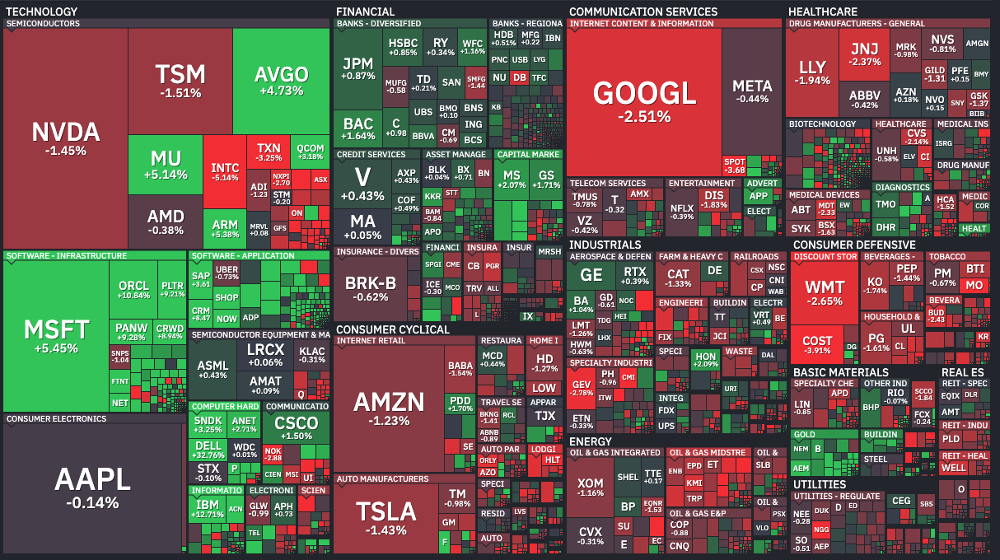

# IsUp — Service Status Heatmap

A live **up / down heatmap** for 40+ popular internet services, rendered as a
stock-map style treemap with brand logos. Built on a single
[Cloudflare Worker](https://developers.cloudflare.com/workers/): a **Cron
Trigger** polls each service's official status and persists snapshots + an
incident log to **D1**, and a static frontend renders the treemap with
per-service uptime, an incident history, a command palette, light/dark themes,
and a mobile-friendly detail sheet.



## Features

- **Treemap heatmap** — services grouped into category "sectors", tiles sized by
  prominence and colored by status, each with a brand logo.
- **Per-service detail** — hover a tile (desktop) or tap it (mobile, opens a
  bottom sheet) for status, 24h/7d uptime, component rollup, active incident,
  and a **"Visit status page"** link.
- **Incident history** — server-recorded incidents (open/close/duration),
  persisted in D1 and shown in a side panel and per-service.
- **Command palette (⌘K)** — fuzzy-search services and run commands.
- **Local customization** — show/hide services or categories and a
  "problems only" filter, persisted in `localStorage`.
- **Notifications** — in-page toasts on status changes, plus optional opt-in
  **desktop notifications**.
- **Light / dark theme**, deep links (`?service=`, `?filter=problems`), and a
  favicon/title that reflect overall state.

## How it works

```
Cron (every 5m) ─▶ scheduled() ─▶ resolveStatus() × N      ┌─▶ Statuspage JSON   ({base}/api/v2/summary.json)
                       │                                    ├─▶ Slack status API
                       │   (src/sources.ts) ────────────────┼─▶ RSS / Atom feed   (fast-xml-parser)
                       │                                    └─▶ HTTP reachability ping
                       └─▶ persist to D1 (src/db.ts): upsert `current`,
                           open/close `incidents`; daily retention sweep
Browser (public/) ─poll /api/status every 45s─▶ Worker reads D1 (Cache-API fronted) ─▶ treemap + uptime
                  └─open detail / panel ───────▶ GET /api/incidents (cached)        ─▶ incident history
```

- A **Cron Trigger** (`*/5 * * * *`) invokes `scheduled()`, which resolves every
  service **concurrently** (`Promise.allSettled`, each upstream guarded by an 8s
  timeout + edge caching) and persists the result to D1. Transitions to/from a
  non-`up` state open and close rows in an `incidents` table. Resolved incidents
  older than 90 days are pruned once a day (~03:00 UTC).
- `GET /api/status` is a **fast D1 read** of the latest snapshot, with per-service
  **uptime (24h / 7d)** computed from incident intervals. It's fronted by the
  **Cache API** (~30s), so the fan-out runs at most once per TTL; before the first
  cron run populates D1 it falls back to a live fan-out so the page is never blank.
- `GET /api/incidents` returns the recent incident log (also Cache-API fronted).
- Both API routes are **rate-limited** per IP (60 req / 60s) via a Workers
  rate-limit binding.
- The frontend ([public/app.js](public/app.js)) lays services out with a
  **squarified treemap**; tiles are sized by a per-service `weight` (layout only).

## Status model

Every service is normalized to one of: `up` · `degraded` · `down` · `unknown`.

| Source type   | How status is derived |
|---------------|-----------------------|
| **Statuspage** | Reads `{base}/api/v2/summary.json` (Atlassian). `status.indicator` maps: `none`→`up`, `minor`/`maintenance`→`degraded`, `major`/`critical`→`down`. The summary also yields component rollups and active incidents for the detail view. |
| **Slack**      | Reads Slack's bespoke API. No active incidents → `up`; an incident of type `outage` → `down`; otherwise → `degraded`. |
| **RSS / Atom** | Parses the latest feed entry (via `fast-xml-parser`). Entries older than 48h are treated as resolved (`up`). A fresh entry mentioning *resolved/restored/operational* → `up`; *outage/down/major/critical* → `down`; anything else fresh → `degraded`. Heuristic. |
| **HTTP ping**  | A plain `GET`. `2xx`/`3xx` → `up`; other response → `degraded`; network error or timeout → `down`. |
| *(any)*        | A failed fetch or timeout → `unknown` (treated as "no data" — never opens an incident or counts as downtime). |

> Statuspage JSON is authoritative where available. RSS-based status is a
> best-effort heuristic, since incident feeds describe history rather than a
> current-state field.

## Data sources

All data comes from each service's **own public status page / feed**. IsUp is a
read-only aggregator and is not affiliated with any of these services. The list
lives in [src/services.ts](src/services.ts); for Statuspage entries the
`/api/v2/summary.json` path is appended to the `base` shown below.

| Service | Category | Source | Endpoint / base |
|---------|----------|--------|-----------------|
| GitHub | Developer & Cloud | Statuspage | `https://www.githubstatus.com` |
| Cloudflare | Developer & Cloud | Statuspage | `https://www.cloudflarestatus.com` |
| npm | Developer & Cloud | Statuspage | `https://status.npmjs.org` |
| DigitalOcean | Developer & Cloud | Statuspage | `https://status.digitalocean.com` |
| Vercel | Developer & Cloud | Statuspage | `https://www.vercel-status.com` |
| Netlify | Developer & Cloud | Statuspage | `https://www.netlifystatus.com` |
| MongoDB | Developer & Cloud | Statuspage | `https://status.mongodb.com` |
| Sentry | Developer & Cloud | Statuspage | `https://status.sentry.io` |
| CircleCI | Developer & Cloud | Statuspage | `https://status.circleci.com` |
| Linode | Developer & Cloud | Statuspage | `https://status.linode.com` |
| Render | Developer & Cloud | Statuspage | `https://status.render.com` |
| AWS | Developer & Cloud | RSS | `https://status.aws.amazon.com/rss/all.rss` |
| OpenAI | AI | Statuspage | `https://status.openai.com` |
| Anthropic | AI | Statuspage | `https://status.claude.com` |
| xAI | AI | RSS | `https://status.x.ai/feed.xml` |
| Groq | AI | Statuspage | `https://groqstatus.com` |
| ElevenLabs | AI | Statuspage | `https://status.elevenlabs.io` |
| Cohere | AI | Statuspage | `https://status.cohere.com` |
| Replicate | AI | Statuspage | `https://www.replicatestatus.com` |
| Pinecone | AI | Statuspage | `https://status.pinecone.io` |
| Runway | AI | Statuspage | `https://status.runwayml.com` |
| Stripe | Payments | Statuspage | `https://www.stripestatus.com` |
| Coinbase | Payments | Statuspage | `https://status.coinbase.com` |
| Shopify | Payments | Statuspage | `https://www.shopifystatus.com` |
| Plaid | Payments | Statuspage | `https://status.plaid.com` |
| Discord | Communication | Statuspage | `https://discordstatus.com` |
| Slack | Communication | Slack API | `https://slack-status.com/api/v2.0.0/current` |
| Zoom | Communication | Statuspage | `https://www.zoomstatus.com` |
| Twilio | Communication | Statuspage | `https://status.twilio.com` |
| SendGrid | Communication | Statuspage | `https://status.sendgrid.com` |
| Atlassian | Productivity & Media | Statuspage | `https://status.atlassian.com` |
| Dropbox | Productivity & Media | Statuspage | `https://status.dropbox.com` |
| Datadog | Productivity & Media | Statuspage | `https://status.datadoghq.com` |
| Reddit | Productivity & Media | Statuspage | `https://www.redditstatus.com` |
| Figma | Productivity & Media | Statuspage | `https://status.figma.com` |
| Box | Productivity & Media | Statuspage | `https://status.box.com` |
| Squarespace | Productivity & Media | Statuspage | `https://status.squarespace.com` |
| Wikipedia | Productivity & Media | HTTP ping | `https://www.wikipedia.org` |
| Twitch | Gaming & Entertainment | Statuspage | `https://status.twitch.com` |
| Epic Games | Gaming & Entertainment | Statuspage | `https://status.epicgames.com` |
| Netflix | Gaming & Entertainment | HTTP ping | `https://www.netflix.com` |

To add a service, append an entry to [src/services.ts](src/services.ts) with its
`category`, a `weight` (tile size), and a `source`. Brand logos are mapped by
service id in `LOGO_DOMAIN` ([public/app.js](public/app.js)) and fetched from
DuckDuckGo's icon CDN.

> **Tips:** Statuspage hosts often `302`-redirect to a canonical domain
> (e.g. `status.zoom.us` → `www.zoomstatus.com`) — use the canonical host to
> avoid an extra hop. Some hosts (e.g. `status.x.ai`) put the JSON behind a
> Cloudflare bot challenge; use their RSS feed instead.

## Security

- **Rate limiting** — `/api/*` is capped at 60 requests / 60s per IP via a
  Workers rate-limit binding (`API_RATE_LIMITER`); over-limit returns `429`.
- **Caching** — `/api/status` and `/api/incidents` are wrapped in the Cache API,
  so repeated requests are served without re-hitting D1 or upstreams.
- **Headers / CSP** — [public/_headers](public/_headers) sets a strict
  `Content-Security-Policy` (no inline scripts), `X-Content-Type-Options`,
  `X-Frame-Options`, `Referrer-Policy`, and `Permissions-Policy` on static
  assets; the Worker adds `nosniff` + `Referrer-Policy` to API responses.

## Analytics

Google Analytics (GA4) is wired in [public/analytics.js](public/analytics.js)
and loads **only in production** — it's gated to non-localhost hosts (so it's
off during `wrangler dev`) and injected from a same-origin module to avoid an
inline script under the CSP. Update or remove `GA_ID` there to change it.

## Development

| Command | Purpose |
|---------|---------|
| `npm install` | Install dependencies (`fast-xml-parser`, `wrangler`). |
| `npm run db:schema:local` | Apply [`schema.sql`](schema.sql) to the **local** D1 (run once before first dev). |
| `npm run dev` | Local dev server at `http://localhost:8787`. |
| `npm run dev:cron` | Dev server with `--test-scheduled` so the cron can be triggered locally. |
| `npm run types` | Regenerate Worker types (`wrangler types`) after editing `wrangler.jsonc`. |
| `npm run typecheck` | `tsc --noEmit`. |
| `npm run deploy` | Deploy to Cloudflare. |

Trigger the cron and inspect the API locally:

```sh
npm run dev:cron
curl "http://localhost:8787/__scheduled"      # runs scheduled() once → persists a snapshot
curl -s http://localhost:8787/api/status | jq # served from D1, includes per-service uptime
curl -s http://localhost:8787/api/incidents | jq
```

> **Local cron note:** under plain `wrangler dev`, the documented
> `/cdn-cgi/handler/scheduled` test route currently throws a
> `DataCloneError: ... ScheduledController` (a wrangler local-shim bug). Use
> `npm run dev:cron` (`--test-scheduled`) and the `/__scheduled` route instead.
> Production crons invoke `scheduled()` natively and are unaffected.

## Deploying (D1 setup)

```sh
npx wrangler d1 create isup          # paste the printed database_id into wrangler.jsonc
npm run db:schema:remote             # create tables + indexes in the remote D1 (idempotent)
npm run deploy
```

> `wrangler.jsonc` sets `workers_dev: false`, so the `*.workers.dev` URL is
> disabled — attach a **custom domain / route** (Cloudflare dashboard or a
> `routes` entry) before deploying, or the Worker has no public URL. Re-run
> `db:schema:remote` after adding indexes/tables (`CREATE … IF NOT EXISTS` is
> idempotent).

## Project structure

```
public/            Static frontend (served directly by Cloudflare)
  index.html         Page shell: header/toolbar, treemap, panels, detail modal, palette
  styles.css         Treemap palette, hover card, panels, command palette, bottom sheet, themes
  app.js             Poll loop, treemap, logos, detail sheet, palette, customization, toasts
  analytics.js       GA4 loader, production-only
  _headers           Security headers / CSP for static assets
src/
  index.ts           Worker entry: scheduled() cron + rate-limited, cached /api/status & /api/incidents
  services.ts        Curated service list + status data sources + shared types
  sources.ts         Per-source-type fetch + normalize (Statuspage/Slack/RSS/HTTP)
  db.ts              D1 persistence: snapshot upserts, incident transitions, uptime, retention
schema.sql           D1 schema (current / incidents / meta) + indexes
wrangler.jsonc       Worker config (main, assets, cron, D1, rate limit)
```

## Notes & limitations

- **Persistence** lives in D1: the `current` snapshot (one row per service),
  an `incidents` log (one row per non-`up` episode), and a `meta` row for the
  last run. Uptime is derived from incident intervals — no high-volume per-poll
  table — and incident queries are index-backed to keep D1 row reads low and flat
  as history grows.
- **History horizon** — resolved incidents are pruned after 90 days
  (`RETENTION_MS` in [src/db.ts](src/db.ts)); raise it for longer history.
- **Granularity** — status/uptime update every 5 minutes (the cron cadence); the
  UI polls every 45s and serves cached data in between.
- RSS status is heuristic (see the status-model table).
- `cf: { cacheTtl }` edge caching and the Cache API are no-ops/limited under
  `wrangler dev`, so local runs hit upstreams live on each cache miss; production
  caches aggressively. The native rate limiter is eventually-consistent and
  per-location, so its cutoff is best-effort rather than an exact count.
